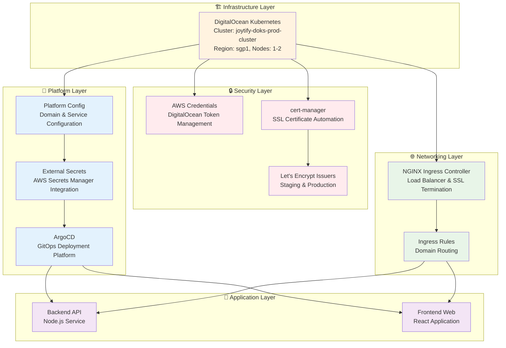

#  Joytify Infrastructure

> Infrastructure as Code for Joytify's Kubernetes platform with GitOps workflows

## 📋 Project Documentation

- **🏠 [Main Application](https://github.com/JIAN11442/MERN-Joytify/tree/main)** - Application overview, tech stack, features
- **🏗️ [Infrastructure Pipeline](https://github.com/JIAN11442/MERN-Joytify/tree/main/terraform)** - AWS Lambda processing pipeline, capacity analysis
- **📚 [Shared Types](https://github.com/JIAN11442/joytify-shared-types)** - Shared TypeScript interfaces
- **🚀 [Kubernetes Infrastructure](./README.md)** - Kubernetes platform with GitOps workflows _(You are here)_

---

## 📋 Table of Contents

- [🎯 What This Does](#-what-this-does)
- [🔗 How It Fits](#-how-it-fits)
- [🏗️ Architecture](#️-architecture)
  - [Default Configuration](#default-configuration)
- [🚀 Installation Steps](#-installation-steps)
  - [Prerequisites](#prerequisites)
  - [1. Prerequisites Setup](#1-prerequisites-setup)
  - [2. Understanding Taskfile Operations](#2-understanding-taskfile-operations)
  - [3. Deploy Infrastructure](#3-deploy-infrastructure)
    - [Step 1: Compute Layer](#step-1-compute-layer)
    - [Step 2: Kubeconfig Setup](#step-2-kubeconfig-setup)
    - [Step 3: Networking Layer](#step-3-networking-layer)
    - [Step 4: Platform Configuration](#step-4-platform-configuration)
    - [Step 5: Security Credentials](#step-5-security-credentials)
    - [Step 6: Certificate Manager](#step-6-certificate-manager)
    - [Step 7: Certificate Issuers](#step-7-certificate-issuers)
    - [Step 8: External Secrets](#step-8-external-secrets)
    - [Step 9: ArgoCD Platform](#step-9-argocd-platform)
    - [Step 10: ArgoCD Ingress Rules](#step-10-argocd-ingress-rules)
  - [4. Destroy Infrastructure](#4-destroy-infrastructure)
- [✅ Verify Deployment](#-verify-deployment)

---

## 🎯 What This Does

This infrastructure creates a complete Kubernetes platform for Joytify with:

- **DigitalOcean Kubernetes cluster** with auto-scaling nodes
- **ArgoCD** for GitOps-based application deployment
- **cert-manager** with Let's Encrypt for automated SSL certificates
- **External Secrets Operator** for secure credential management
- **NGINX Ingress** for load balancing and SSL termination

## 🔗 How It Fits

This infrastructure serves as the foundation layer for the Joytify platform:

- **joytify-infra** (this repo) - Creates the Kubernetes platform and platform services
- **joytify-helm** - Deploys applications using the infrastructure created here
- **joytify-app** - Contains the application code that gets deployed via GitOps
- **joytify-types** - Shared TypeScript types used by the application

The infrastructure provides the secure, automated platform that enables GitOps-based application deployment.

## 🏗️ Architecture



### Default Configuration

**DigitalOcean Cluster**
- Cluster: `joytify-doks-prod-cluster`
- Region: sgp1, Nodes: 1-2 (auto-scaling)
- Node size: s-2vcpu-2gb

**Platform Services**
- ArgoCD: `argocd` namespace
- cert-manager: `cert-manager` namespace  
- External Secrets: `external-secrets-system` namespace
- NGINX Ingress: `ingress-nginx` namespace

**Security**
- SSL: Let's Encrypt staging and production issuers
- Secrets: AWS Secrets Manager integration
- RBAC: Role-based access control enabled

## 🚀 Installation Steps

### Prerequisites
- DigitalOcean account
- AWS account (for secrets management)
- Terraform >= 1.0
- Terragrunt >= 0.45
- kubectl >= 1.25
- Task (automation tool)

### 1. Prerequisites Setup

**a. Configure Secrets**
Create AWS Secrets Manager secret `JOYTIFY_INFRA_ENVS`:
```json
{
  "DIGITALOCEAN_TOKEN": "your-do-token"
}
```

**b. Install Task**
```bash
brew install go-task
```

### 2. Understanding Taskfile Operations
You can view all available commands using:
```bash
task help
# or
task --list
```

The `./Taskfile.yaml` provides comprehensive automation with these operations for each component:
- **plan**: Preview infrastructure changes
- **validate**: Validate Terraform configurations
- **deploy**: Apply infrastructure changes
- **destroy**: Remove infrastructure resources
- **output**: Display component outputs

### 3. Deploy Infrastructure
```bash
# Deploy step by step (recommended)
task compute:cluster:deploy
task kubeconfig
task networking:ingress:controller:deploy
task platform:config:deploy
task security:credentials:deploy
task security:certificates:manager:deploy
task security:certificates:issuers:deploy
task platform:secrets:deploy
task platform:argocd:deploy
task networking:ingress:rules:deploy
```

### Step 1: Compute Layer
```bash
task compute:cluster:deploy
```
- Creates DigitalOcean Kubernetes cluster (`joytify-doks-prod-cluster`)
- Region: sgp1, Nodes: 1-2 (auto-scaling)
- Node size: s-2vcpu-2gb

### Step 2: Kubeconfig Setup
```bash
task kubeconfig
```
- Downloads cluster kubeconfig
- Merges with local kubectl config
- Verifies cluster connectivity

### Step 3: Networking Layer
```bash
task networking:ingress:controller:deploy
```
- Deploys NGINX Ingress Controller
- Creates LoadBalancer service for external access

### Step 4: Platform Configuration
```bash
task platform:config:deploy
```
- Uses LoadBalancer IP to define domains (api.domain.com, web.domain.com, argocd.domain.com)
- Updates AWS Secrets Manager for joytify-helm usage

### Step 5: Security Credentials
```bash
task security:credentials:deploy
```
- Creates Kubernetes secrets for External Secrets and private image registry
- Enables joytify-helm to use secrets without hardcoding

### Step 6: Certificate Manager
```bash
task security:certificates:manager:deploy
```
- Deploys cert-manager for SSL automation
- Creates CRDs for certificate management

### Step 7: Certificate Issuers
```bash
task security:certificates:issuers:deploy
```
- Creates Let's Encrypt staging issuer
- Creates Let's Encrypt production issuer
- Configures automatic SSL certificate generation

### Step 8: External Secrets
```bash
task platform:secrets:deploy
```
- Deploys External Secrets Operator
- Integrates with AWS Secrets Manager
- Sets up secure credential injection

### Step 9: ArgoCD Platform
```bash
task platform:argocd:deploy
```
- Deploys ArgoCD for GitOps
- Creates ArgoCD namespace and services
- Configures GitOps deployment platform

### Step 10: ArgoCD Ingress Rules
```bash
task networking:ingress:rules:deploy
```
- Creates ingress rules for ArgoCD platform access
- Note: Application ingress rules are created by joytify-helm

### 4. Destroy Infrastructure
```bash
# Destroy entire infrastructure stack
task all:destroy
```

## ✅ Verify Deployment

```bash
# Check cluster status
kubectl get nodes
kubectl get pods -A

# Check platform services
kubectl get pods -n argocd
kubectl get pods -n cert-manager
kubectl get pods -n external-secrets-system
kubectl get pods -n ingress-nginx

# Check certificates
kubectl get certificates -A
kubectl get clusterissuers

# Check external secrets
kubectl get externalsecrets -A

# Check ingress
kubectl get ingress -A
```
