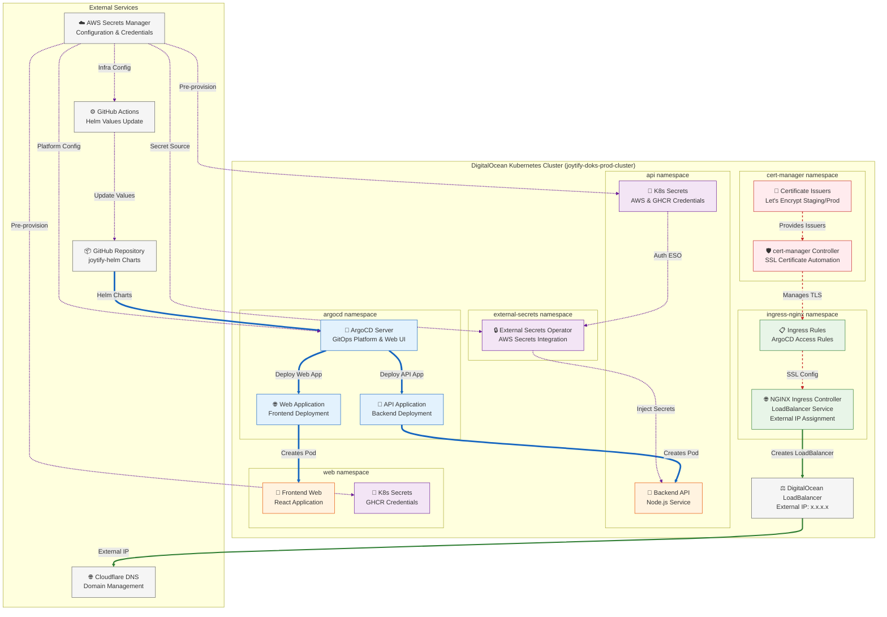

#  Joytify Infrastructure

> Infrastructure as Code for Joytify's Kubernetes platform with GitOps workflows

## 📋 Project Documentation

- **⚙️ [GitHub Workflows](https://github.com/JIAN11442/joytify-app/tree/main/.github)** - CI/CD for testing, building images, and updating Helm chart values
- **📦 [Helm Charts](https://github.com/JIAN11442/joytify-helm)** - Frontend/backend deployments with ingress, services, and configurations
- **🚀 [Kubernetes Infrastructure](https://github.com/JIAN11442/joytify-infra)** - Platform services required for deployment (ArgoCD, ingress, cert-manager, etc.) _(You are here)_

---

## 📋 Table of Contents

- [🎯 Overview](#-overview)
- [🏗️ Architecture](#️-architecture)
- [🚀 Installation Steps](#-installation-steps)
  - [Prerequisites](#prerequisites)
  - [Deployment Steps](#deployment-steps)
    - [1. Understanding Taskfile Operations](#1-understanding-taskfile-operations)
    - [2. Deploy Infrastructure](#2-deploy-infrastructure)
      - [Step 1: Compute Layer](#step-1-compute-layer)
      - [Step 2: Kubeconfig Setup](#step-2-kubeconfig-setup)
      - [Step 3: Platform Configuration](#step-3-platform-configuration)
      - [Step 4: Networking - Ingress Controller](#step-4-networking---ingress-controller)
      - [Step 5: Networking - DNS](#step-5-networking---dns)
      - [Step 6: Security Credentials](#step-6-security-credentials)
      - [Step 7: Certificate Manager](#step-7-certificate-manager)
      - [Step 8: Certificate Issuers](#step-8-certificate-issuers)
      - [Step 9: External Secrets](#step-9-external-secrets)
      - [Step 10: ArgoCD Platform](#step-10-argocd-platform)
      - [Step 11: ArgoCD Ingress Rules](#step-11-argocd-ingress-rules)
      - [Step 12: GitOps Applications](#step-12-gitops-applications)
  - [Access ArgoCD](#access-argocd)
- [⚙️ Configuration & Scaling](#️-configuration--scaling)
- [📊 Monitoring & Status](#-monitoring--status)
- [💥 Destroy Infrastructure](#-destroy-infrastructure)

---

## 🎯 Overview

This repository contains Terragrunt configurations that create a production-ready Kubernetes platform for Joytify. It provisions the complete GitOps infrastructure needed to automatically deploy and manage the Joytify application stack.

**What this repository does:**

- Creates a DigitalOcean Kubernetes cluster with all necessary platform services
- Sets up GitOps continuous deployment using ArgoCD
- Configures automated SSL certificate management and DNS routing
- Establishes secure secret management integrated with AWS
- Provides a foundation for the joytify-helm application deployments

## 🏗️ Architecture



The architecture diagram above shows the complete infrastructure stack this repository creates:

### **GitOps Platform (Blue Flow)**

- **ArgoCD Server**: GitOps controller that monitors the joytify-helm repository
- **Application Definitions**: Automated deployment of API and Web applications
- **Continuous Deployment**: Code changes trigger automatic infrastructure updates

### **Networking & DNS (Green Flow)**

- **NGINX Ingress Controller**: Routes external traffic to applications
- **DigitalOcean LoadBalancer**: Provides external IP for cluster access
- **Cloudflare DNS**: Automatic domain management for api, web, and argocd subdomains

### **Security Layer (Red Flow)**

- **cert-manager**: Automated SSL certificate provisioning and renewal
- **Let's Encrypt Integration**: Free SSL certificates with automatic renewal
- **TLS Configuration**: Secure HTTPS access for all services

### **Configuration Management (Purple Flow)**

- **AWS Secrets Manager**: Centralized secret storage and configuration hub
- **GitHub Actions**: Reads infra configuration from AWS to update Helm chart values
- **Pre-provisioned K8s Secrets**: Two types of credentials created by infra:
  - **aws-credentials** (api namespace): AWS access keys for External Secrets Operator authentication
  - **ghcr-secret** (api & web namespaces): GitHub Container Registry credentials for private image pulls
- **External Secrets Operator**: Secure injection of runtime secrets into backend API pods (frontend uses build-time secrets)
- **Platform Configuration**: Service discovery and environment-specific settings that sync between infra and helm

---

## 🚀 Installation Steps

### Prerequisites

#### Required Accounts & Services

- **DigitalOcean Account** - Kubernetes cluster hosting
- **AWS Account** - Terraform state storage and secrets management
  - S3 bucket for Terraform state
  - DynamoDB table for state locking
  - Secrets Manager for configuration storage
- **Cloudflare Account** - DNS management and domain routing

#### Required Tools & Versions

- **Terraform**: `~> 1.5.7` (exact version for stability)
- **Terragrunt**: `>= 0.45.0` (infrastructure orchestration)
- **kubectl**: `>= 1.25.0` (Kubernetes cluster access)
- **Task**: Latest version (automation tool)
- **AWS CLI**: Configured with appropriate credentials

#### Installation Commands

```bash
# macOS installation
brew install terraform terragrunt kubectl go-task awscli

# Verify installations
terraform version    # Should show ~1.5.7
terragrunt --version # Should show >=0.45.0
kubectl version --client
task --version
aws --version
```

#### Required Credentials Setup

**AWS Credentials**

```bash
aws configure
# OR set environment variables:
# export AWS_ACCESS_KEY_ID="your-access-key"
# export AWS_SECRET_ACCESS_KEY="your-secret-key"
# export AWS_DEFAULT_REGION="ap-northeast-1"
```

**AWS Secrets Manager Configuration**

Create secret named `JOYTIFY_INFRA_ENVS` with:

```json
{
  "DO_TOKEN": "your-digitalocean-api-token",
  "CLOUDFLARE_API_TOKEN": "your-cloudflare-api-token",
  "CLOUDFLARE_ZONE_ID": "your-cloudflare-zone-id",
  "AWS_ACCESS_KEY_ID": "your-aws-access-key-for-eso",
  "AWS_SECRET_ACCESS_KEY": "your-aws-secret-key-for-eso",
  "GHCR_TOKEN": "your-github-container-registry-token",
  "ARGOCD_REPO_TOKEN": "your-github-repo-access-token",
  "CERTIFICATE_EMAIL": "your-ssl-certificate-email@domain.com",
  "WEB_DOMAIN": "your-web-domain.com",
  "API_DOMAIN": "your-api-domain.com",
  "ARGOCD_DOMAIN": "your-argocd-domain.com",
  "API_PORT": 4004,
  "WEB_PORT": 5173,
  "API_SERVICE_NAME": "api-service",
  "API_SERVICE_PORT": 4004,
  "WEB_SERVICE_NAME": "web-service",
  "WEB_SERVICE_PORT": 5173,
  "AWS_CREDENTIALS_NAME": "aws-credentials",
  "AWS_CREDENTIAL_ID_KEY": "access-key-id",
  "AWS_CREDENTIAL_SECRET_KEY": "secret-access-key",
  "GHCR_SECRET_NAME": "ghcr-secret",
  "CLUSTER_ISSUER": "letsencrypt-prod",
  "OFFICIAL_EMAIL": "noreply@your-domain.com"
}
```

### Deployment Steps

#### 1. Understanding Taskfile Operations

This project uses **Task** to manage all deployment commands, so you don't need to navigate to subdirectories and run `terragrunt` commands manually. All operations are centralized and can be run from the project root.

You can view all available commands using:

```bash
task help
# or
task --list
```

The `./Taskfile.yaml` provides comprehensive automation with these operations:

**Component Operations** (for each infrastructure component):

- **plan**: Preview infrastructure changes
- **validate**: Validate Terraform configurations
- **deploy**: Apply infrastructure changes
- **destroy**: Remove infrastructure resources
- **output**: Display component outputs

**Global Operations**:

- **all:deploy**: Deploy entire infrastructure stack
- **all:destroy**: Destroy entire infrastructure stack
- **all:plan**: Preview all changes

**Utility Operations**:

- **kubeconfig**: Setup cluster access
- **status**: Check infrastructure status
- **cleanup-kubeconfig**: Clean temporary files
- **cleanup-state**: Clean up Terraform state resources

#### 2. Deploy Infrastructure

**Recommended Approach**: Deploy components step-by-step for better control and troubleshooting. While `task all:deploy` is available, it may encounter unpredictable timing issues between components.

**If using `all:deploy` encounters issues**: Destroy only the problematic component and continue with step-by-step deployment:

```bash
# Example: if ingress controller fails
task networking:ingress:controller:destroy
# Then continue with step-by-step from that point
```

**Step-by-Step Deployment** (Recommended):

```bash
# Deploy step by step (recommended)
task compute:cluster:deploy
task kubeconfig
task platform:config:deploy
task networking:ingress:controller:deploy
task networking:dns:deploy
task security:credentials:deploy
task security:certificates:manager:deploy
task security:certificates:issuers:deploy
task platform:secrets:deploy
task platform:argocd:deploy
task networking:ingress:rules:deploy
task platform:gitops:deploy
```

##### Step 1: Compute Layer

```bash
task compute:cluster:deploy
```

- Creates DigitalOcean Kubernetes cluster (`joytify-doks-prod-cluster`)
- Region: sgp1, Nodes: 1 node
- Node size: s-2vcpu-2gb

##### Step 2: Kubeconfig Setup

```bash
task kubeconfig
```

- Downloads cluster kubeconfig from DigitalOcean
- Merges configuration to local default kubectl path (`~/.kube/config`)
- Enables local machine to access and operate the remote cluster
- Verifies cluster connectivity

##### Step 3: Platform Configuration

```bash
task platform:config:deploy
```

- Reads configuration from `JOYTIFY_INFRA_ENVS` secret
- Sets up service discovery and platform configuration
- Synchronizes configuration between infrastructure and helm charts
- Prepares platform settings for subsequent components

##### Step 4: Networking - Ingress Controller

```bash
task networking:ingress:controller:deploy
```

- Deploys NGINX Ingress Controller
- Creates LoadBalancer service for external access

##### Step 5: Networking - DNS

```bash
task networking:dns:deploy
```

- Uses LoadBalancer external IP from previous step
- Creates three Cloudflare DNS records: root domain (@), api, and argocd subdomains
- Sets DNS-only mode (not proxied) - Helm will configure ingress rules later

##### Step 6: Security Credentials

```bash
task security:credentials:deploy
```

- Creates Kubernetes secrets: AWS credentials for External Secrets Operator and GHCR tokens for image pulls
- Enables GitHub Actions and Helm charts to reference secrets by ID instead of hardcoding sensitive tokens

##### Step 7: Certificate Manager

```bash
task security:certificates:manager:deploy
```

- Installs cert-manager controller and CRDs
- Provides SSL certificate automation capabilities
- Creates the foundation for certificate management (but needs issuers to function)

##### Step 8: Certificate Issuers

```bash
task security:certificates:issuers:deploy
```

- Creates Let's Encrypt certificate issuers (staging and production)
- Configures cert-manager with certificate authorities to request from
- Enables automatic SSL certificate generation for ingress resources

##### Step 9: External Secrets

```bash
task platform:secrets:deploy
```

- Deploys External Secrets Operator for runtime secret injection
- Prepares infrastructure for API (backend) to access AWS Secrets Manager
- Enables secure credential injection into backend pods (frontend secrets are injected during image build)

##### Step 10: ArgoCD Platform

```bash
task platform:argocd:deploy
```

- Deploys ArgoCD server and controller for GitOps continuous deployment
- Configures ArgoCD domain and RBAC (admin/devops roles)
- Sets up ArgoCD as ClusterIP service (ingress rules configured separately)

##### Step 11: ArgoCD Ingress Rules

```bash
task networking:ingress:rules:deploy
```

- Creates Kubernetes Ingress resource for ArgoCD with SSL/TLS configuration
- Configures NGINX ingress with cert-manager for automatic SSL certificate generation
- Enables HTTPS access to ArgoCD web interface
- Note: Application ingress rules are created by joytify-helm

##### Step 12: GitOps Applications

```bash
task platform:gitops:deploy
```

- Creates ArgoCD Application resources for joytify-helm repository
- Configures GitOps continuous deployment for API and Web applications
- Enables automatic deployment when joytify-helm repository changes

### Access ArgoCD

After successful deployment, you can access ArgoCD using:

```bash
# Get ArgoCD domain and credentials
task platform:argocd:output

# Or get password directly
kubectl -n argocd get secret argocd-initial-admin-secret -o jsonpath='{.data.password}' | base64 -d
```

**ArgoCD Login:**

- **URL**: `https://argocd.yourdomain.com` (from your ARGOCD_DOMAIN configuration)
- **Username**: `admin`
- **Password**: Use the command above to retrieve the generated password

**Expected ArgoCD Applications:**

After GitOps setup (Step 12), you should see these applications in ArgoCD:


## ⚙️ Configuration & Scaling

### Default Cluster Configuration

- **Region**: sgp1 (Singapore)
- **Node Size**: s-2vcpu-2gb (2 vCPU, 2GB RAM)
- **Initial Nodes**: 1 node
- **Auto-scaling**: Disabled by default
- **Kubernetes Version**: 1.33.1-do.4

### Enable Auto-scaling

To enable auto-scaling, edit `environments/prod/compute/cluster/terragrunt.hcl`:

```hcl
inputs = {
  node_size    = "s-2vcpu-2gb"     # Or upgrade to larger size
  node_count   = 1                 # Initial nodes
  auto_scale   = true              # Enable auto-scaling
  min_nodes    = 1                 # Minimum nodes
  max_nodes    = 5                 # Maximum nodes (adjust as needed)
}
```

### Node Size Options

- `s-1vcpu-2gb`: 1 vCPU, 2GB RAM (basic)
- `s-2vcpu-2gb`: 2 vCPU, 2GB RAM (default)
- `s-2vcpu-4gb`: 2 vCPU, 4GB RAM (more memory)
- `s-4vcpu-8gb`: 4 vCPU, 8GB RAM (high performance)

After cluster configuration changes, run: `task compute:cluster:deploy`

### NGINX Ingress Controller Scaling

**Default**: 1 replica (configured for cost optimization; scale to 3+ replicas for high availability)

For high availability and better performance, edit `modules/networking/ingress/controller/values.yaml`:

```yaml
controller:
  replicaCount: 3 # Multiple replicas for HA and load distribution

  resources:
    requests:
      cpu: 100m
      memory: 128Mi
    limits:
      cpu: 500m # Adjust based on traffic
      memory: 512Mi
```

Then redeploy: `task networking:ingress:controller:deploy`

### Resource Limits for Platform Services

Set appropriate resource limits to prevent resource contention. Edit the respective `values.yaml` files:

**ArgoCD** (`modules/platform/argocd/values.yaml`):

```yaml
server:
  resources:
    requests:
      cpu: 250m
      memory: 256Mi
    limits:
      cpu: 500m
      memory: 512Mi
```

## 📊 Monitoring & Status

```bash
# Basic cluster status
kubectl get nodes
kubectl get pods -A
kubectl get svc -A

# Platform services
kubectl get pods -n argocd
kubectl get pods -n cert-manager
kubectl get pods -n external-secrets-system
kubectl get pods -n ingress-nginx

# Ingress and SSL
kubectl get ingress -A
kubectl describe ingress -A
kubectl get certificates -A
kubectl describe certificates -A

# ArgoCD applications
kubectl get applications -n argocd
kubectl describe applications -n argocd

# External secrets
kubectl get externalsecrets -A
kubectl describe externalsecrets -A

# Task commands
task status
task platform:argocd:output
```

## 💥 Destroy Infrastructure

To completely remove the entire infrastructure stack:

```bash
task all:destroy
```

This command will:

- Destroy all Kubernetes resources in reverse deployment order
- Remove the DigitalOcean cluster
- Clean up kubeconfig entries
- Remove Terraform state resources (S3 bucket and DynamoDB table)

**Warning**: This operation is irreversible. All data and configurations will be permanently deleted.
